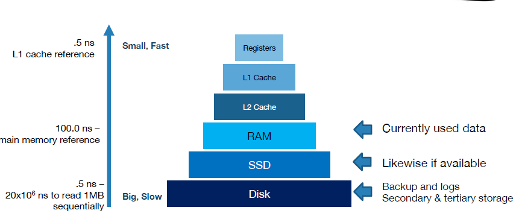
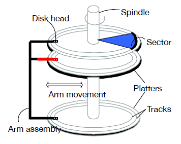
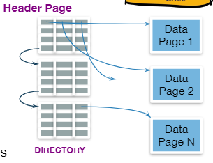
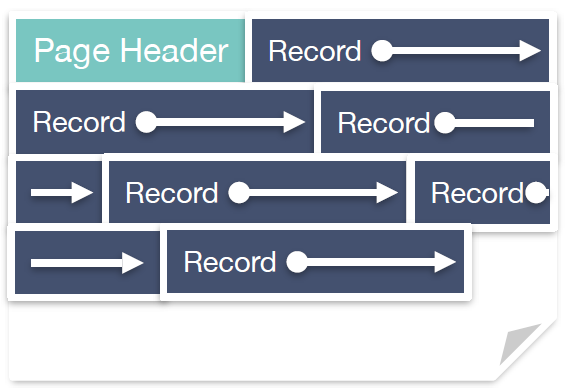
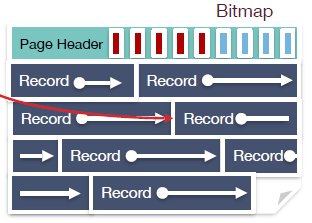
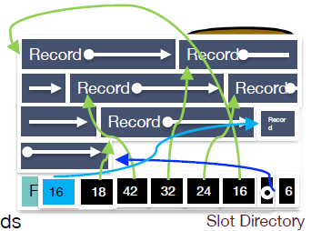
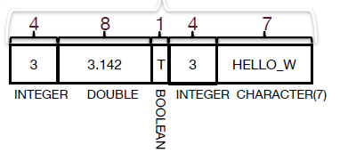
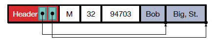
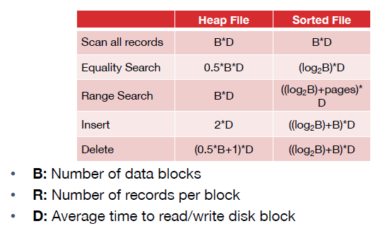

# Disk, Files and Buffers 

## architecture: **how queries are executed**
- Module:
    - **parsing and optimizing**: check it's legal and translate it into a relational query plan by relational operators 
    - **relational operators**: execute a dataflow by operating on **records** and **files**
    - **files and index management**: organize tables and records as groups of pages in a logical file
    - **buffer management**: provide the illusion of operating in memory 
    - **disk space management**: translate page requests into physicla bytes on one or more device(s)
    -----
    - **2 cross-cutting issues related to storage and memory management**: 
        - **Concurrency Control**: how to allow multiple users to use DBMS at the same time without messing up others data
        - **Recovery**: if the DBMS is crashed and can get the important data recovered and get the database backup and running.

## Disk
### Storage Media
- Disks:
    - No "pointer dereference", and use an API instead:
        - READ: data (disk -> RAM)
        - WRITE: data (RAM -> disk)
    - Both API calls are very very slow
    - AN explicit API can minimize the kinds of pointer errors you see in C/C++
- Storage Hierarchy

### Components of Disk

- **Platters spin**: (15000 rpm)
- **Arm assembly**: moved in / out to position a **head** on a desired **track(not exist actually)**
- Only one head reads/writes at any one time -> reads/writes a multiple of **sector size**

***Note: Time to access (read/write) a disk block:***
- **seek time** (moving arms to position disk head on track)
    - 2-3 ms on average
- **rotational delay** (waiting for block to rotate under head)
    - 0-4 ms (15000 rpm)
- **transfer time** (actually moving data to/from disk surface)
    - 0.25 ms per 64KB page
- ***Key to optimizer***: reduce seek / rotational delays

### Notes on Flash (SSD)
- Issues in current generation (NAND)
    - Fine-grain read(4-8K), coarse-grain write(1-2MB)
    - 2k-3k erasures before failure
    - write amplifcation: big units need to reorg for wear and garbage collection

### Disk Space Management
- **Terminology:**  block/page: Unit of transfer for disk read/write
- Read / Write **large chunks of sequential bytes**
- "Next" disk block is cheaper than far-away ones
- Maximize usage of data per read / write
- Predict future behavior 
    - Cache popular blocks 
    - Pre-fetch likely-to-be-accessed blocks
    - Buffer writes to sequential blocks 
- **Purpose of management:** 
    - Map pages to locations on disk 
    - Load pages from disk to memory 
    - Save pages back to disk & ensuring writes
- **Higher levels (Buffer Management) call upon this layer to:**
    - Read/Write a page 
    - Allocate/de-allocate logical pages 
- **Implementation:**
    1. talk to the storage device directly 
        - be fast
        - what if device change 
    2. run over filesystem (FS)
        - allocate single large "contiguous" file on a nice empty disk
        - most FS optimize disk layout for sequential access
        - DBMS "file" may span multiple FS files on multiple disks/machines

## Files 
### Overview: 
- Table <- Page <- collections of records
- Pages: 
    - **On disk** are managed by **disk manager** (read/written to physicla disk/files)
    - **In memory** are managed by the **buffer manager**, higher levels of DBMS only operate in memory 

### Files of Pages of Records 
- **API** for higher layers of the DBMS:
    - Read:
        - Fetch a particular record by **record id** [a pointer encoding pair of (**pageID, location** on page)]
        - Scan all records [possibly with some cases on the records to be retrived]
    - Update:
        - Insert/delete/modify records
- Could span multiple OS files and even machines 

### DB File Structures 
- **Unordered Heap Files**
    - def: Records placed arbitrarily 
    across pages
    - As file shrink/grow, pages (de)allocated
    - To support record level operation: 
        - keep track of the pages in a file 
        - keep track of free space on pages 
        - keep track of the records on a page 
- **Clustered Heap Files**
    - def: Records and pages are grouped 
- **Sorted Files**
    - def: Pages and records are in sorted order 
- **Index Files** 
    - def: ***B+ Trees***, Linear Hashing..., many contain records or point to records in other files 

### Implementation 
- Heap File implemented as List
    - double linked list 
    - 1 way to full pages, 1 way to free pages
    - ***Problem: may be inefficient when finding a page with enough space***

- Heap File implemented as **Page Directory**
    - directory entries include free bytes on the referenced page (pair of the number of free bytes on a page and a pointer to that page )
    - Header pages accessed often -> likely in cache

### Page Layout
- Page Header (contains):
    - Number of records
    - Free Space 
    - Maybe a next/last pointer
    - Bitmaps, Slot Table 
    - etc. 
- Options: 
    - Record Length:
        - Fixed
        - Variable
    - Page Layout:
        - Packed 
        - Unpacked 
        
#### Layout Detail 
**1. Fixed Length Records, Packed**
- pack densely 
- Record id = (pageID, record number)
- offset from the start of page:
    - Offset = header + (record size) * (n - 1)   
- **add:** append at last 
- **delete:** 
    - packed means re-arrange the records
    - record id needs to be updated
    - could be expensive if they're in other files

**2. Fixed Length Records, Unpacked**
- Bitmap denotes "slots" of records 
- **add:** find first empty slot in the bitmap 
- **delete:** 
    - clear bit 
    - no reorgnization needed 
    - bitmap cost is small, really compact 

**3. Variable Length Records** 
- create the slot directory as a footer, from right to left 
- **delete:**
    - set the according slot directory pointer to NULL
- **add:**
    - place record in free space on page 
    - create pointer/length pair in next open slot in slot directory 
    - update the free space pointer
    - ***reorganize the date on the page***
        - it's safe because records ids don't change
        - we could re-organize when delete or wait until fragmentation blocks record addtion and then reorganize. Often a littel lazy if page never gets more records
- **Growing Slots:**
    - use a number at the end of slot directory to track number of slots in slot directory
    - slots grow from end of page inward, records grow from beginning of page inward, finally meet with each other 

### Record Layout (Formats)

**1. Fixed Length**
- Find column via arithmetic (calculate space and it's fast)
- if NULL exists, space will be wasted 

**2. Variable Length**
- store with padding is not good when it comes to string with larger length
- **delimiter(like comma)** is ok but it's inefficient because you need to pass all the fields to find the one you need 
- **solution:** put all variable columns at last and use a header at first, with some pointers to variable columns

### File Organization: 
- Heap File 
- Sorted File 
- Clustered Files & Indexes

### Cost Model for Analysis 
#### Assumption:
We will ignore:
- sequential vs random I/O 
- pre-fetching and cache eviction costs
- any CPU costs after fetching data into memory 
- reading/writing of header pages for heap files 
- **single record** for insertion and deletion
- equality selection - **only one match**
- For Heap Files:
    - Insert always appends to **end of file** 
- For Sorted Files: 
    - always **packed**: files get compacted after deletion 
    - sorted according to search key

### Operation Cost 
- Heap Insert: 
    - read page to memory -> write -> return from memory to page --> 2*D
- Heap Delete:
    - reading (involved in B/2) + writing it again (+1)

    

### Index
An **index** in adata structure that enables fast **lookup** and **modification** of **data entries** by **search key**
- **Types:**
    - B+ Tree
    - Hash 
    - R Tree
    - GiST
    - etc.
- **Lookup:**
    - support many different operations
    - 1-d range, 2-d region ...
- **Search Key:**
    - any subset of columns in the relation
    - don't neet to be unique 
        - e.g. (firstname) or (firstname, lastname)
- **Data entries:**
    - items stored in the index 
    - today: pair (key **k**, recordID)
        - pointers to records in Heap Files
        - Easy to generalize later 
- **Modification:**
    - want to support fats insertion and deletion 
