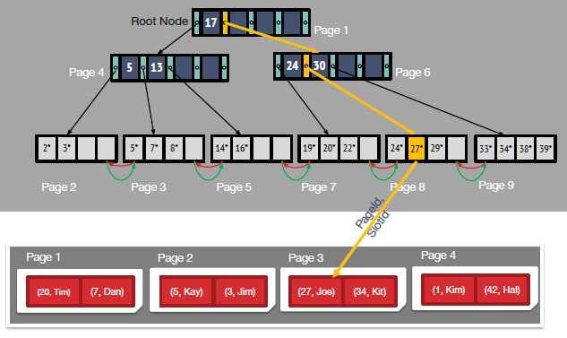

# B+ Tree
------------------

## ISAM (Indexed Sequential Access Method)
**1. Simple Idea:**
- 1. Sort heap file and leave some space 
- 2. use binary search on this heap file, $log_2P$ where $P$ is the number of pages. 
    - Fan-out of 2 --> deep tree --> lots of I/Os 
    - **just to read keys** would be better --> $log_2K$ where $K$ is the number of pages to store keys, and $K << B$

**2. Fix:**
- **recursively** build a lookup page, with fan-out >> 2 

- **Insertion Problem:**
    - Find location 
    - Place in data page and resort the page 
    - Add overflow page if necessary 
    - ***Note: with more and more larger number, linked overflow page take the most part of the ISAM, which is unattractive, adn it could be linear efficiency***
    
**Review:**
- Data entries in sorted heap file
- High fan-out static tree index 
- Fast search + good locality 
    - assuming nothing changes (we don't change the file, no lots of insertions and deletions)
- Insert into **overflow** pages
-------

## B+ Tree 
- all leaf nodes contain key pointers to records
- **B+ Tree: Fetch Data:**

- **Insert: (Algorithm Sketch)** 
    - Find the correct leaf *L*
    - Put data entry onto *L*
        - if *L* has enough space, done 
        - else, must split *L* into *L* and a new node *L2*
            - Redistribute entries evenly, copy up middle key (and ptr to *L2*)
            - Insert index entry pointing to *L2* into parent of *L*
    - Step2 can happen recursively
        - To split index node, redistribute entries evenly, but push up middle key (and ptr to new index node)
        
  
  
  
  
  

- **Delete:**
    - Occupancy Invariant is often not enforced during deletion 
    - Just delete leaf entries and leave space for future inserts
    - If page becomes completely empty, can delete
        - Parent may become underfull 
    - Guarantees still attractive: $log_F(total\ number\ of\ inserts)$

- **Bulk Loading of B+ Tree:**
    - Which way is more efficient when you need to build a B+ tree with a large dataset
    - **Call insertion repeatedly:**
        - constantly need to search from root
        - modifying random pages: poor cache efficiency because of lots of I/O
        - leaves poorly utilized (typically half-empty)
    - **Smarter Bulk Loading:**
        - Sort the input records by key (with higher efficient algorithm we learn later)
        - Fill leaf pages to some fill factor (3/4 for example)
            - updating parent until full
            - Then create new sibling and copy over half: same as in index node splits for insertion
        - Lower Left part of the tree is never touched again due to the ordered data 
        - **Benefits:**
            - Cache utilization than insertion into random locations 
            - utilization of leaf nodes (which leads to shallower tree)
            - layout of leaf pages (more sequential)
