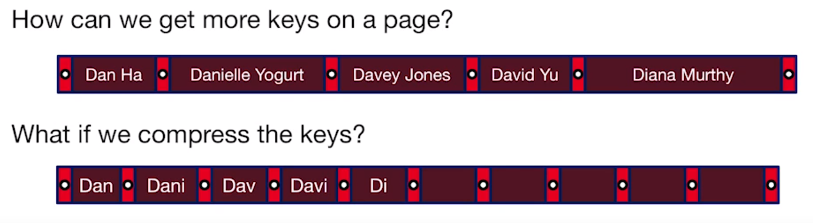

# B+ Tree Refinements 

###  Query Support 

- **Basic Selection:** \<key\> \<op\> \<constant\> 
  - Equality selection (op is =)
  - Range selections (op is one of <, >, <=, >=, BETWEEN)
  - B+ Tree provides both
  - Linear Hash indexes provide only equality 
- **More Exotic Selections:**
  - 2-d box / 2-d circle 
  - **n-dimensional indexes:** R-tree, KD-tree. etc.
    - Beware of the curse of dimensionality  

### Search Key and Ordering

In an ordered index (e.g. B+ Tree), the keys are ordered lexicographically by the search key columns 

- **Composite Search Key**
  - on columns ($k_1$, $k_2$, ..., $k_n$), $k_1$ = <val$_1$>, ..., $k_m$ = <val$_m$> 
  - and most 1 additional *range* clause of: AND $k_{m+1}$ op \<val\>, where op is one of {<, >} 
  - **Note:**
    - equality must be ahead of range clauses 
    - the column of the first search key must be arranged **if the first search key is equality**

### Three Alternatives for Data Entry Storage 

##### 1. By Value  

- Record contents are stored in the index file (tuple in the leaf)
  - No need to follow pointers 

##### 2. By Reference 

- **<k, rid of matching data record> (<key, Record id> Pairs)**
- Record id --> [page id, slot id]

##### 3. By List of references 

- **<k, list of rid of matching data record>**

- a key can be pointed to many record id

  

***Both 2 & 3 index data by reference, which help avoid replicating data and higher complexity*** 

##### Clustered vs. Unclustered Index 

- Clustered Index 
  - Heap file records are kept mostly ordered according to **search keys** in index
    - Heap file order need not to be perfect, just a performance hint 
    - Cost of retrieving data records through index varies greatly based on whether index is clustered or not   

- Clustered index **Insertion**
  - need not to be perfect, so when several heap file goes to somewhere strange, the index still work
  - when there are lots of insertions and the Clustered Index will get broken, you can choose to sort them again to build a clustered index 

- **Clustered Index Pros**
  - Efficient for range searches 
  - Potential locality benefits 
    - Sequential disk access, pre-fetching, etc.
  - Support certain types of compression 
- **Clustered Index Cons**
  - More expensive to maintain 
    - Need to periodically update heap file order 
    - Solution: on the fly or "lazily" via reorganizations 
  - Heap file usually only **packed to $\frac{2}{3}$ ** to accommodate inserts  

### B+ Tree Refinement: Variable Length keys 

what would happen to our occupancy invariant with variant length keys and data in leaf pages 

- Order(d) makes little sense with variable-length entries 
  - Different nodes have different numbers of entries 
  - **Index pages** often hold **more entries** than  leaf pages 
  - Even with fixed length fields, Alternative 3 gives variable length data entries (some are popular, some are unpopular)
- Use a physical criterion in practice
  - **at least half-full**, measured in **bytes**
- Many real systems are even sloppier
  - Only reclaim space when a page is totally empty 

- **Prefix Compress Keys** 

  - use prefix to get more fan-out, which leads to less I/Os and quicker search speed

- compress when split, and **determine the minimum splitting prefix and copy up** 

- **Suffix Compress Keys**

  - when all keys have large common prefix, move common prefix to header 
  - **useful situation**
    - Composite Keys
      - <Zip code, Last Name, First Name> (people have the same zip code, and store the same zip code to header, just show the name)

### B+ Tree Costs 

- Scan all the Records 
  - clustered index is **2/3 full** and it is assumed to be full beforehead, so the cost is **1.5\*B\*D**
- Equality Search 
  - **F: Average internal node fanout**
  - **E: Average # data entries per leaf**
  - **search for certain index:**    $log_F(\frac{BR}{E}+1)\cdot D$
    - **BR** is the total number of records, **E** is the records per leaf, so **BR / E** is the number of leaf 
    - the +1 is an "off by 1" thing: catch the cost of root 
  - Lookup record in heap file by record-id = $1 * D$ , which recall **<page, slot #>**
  - Final Cost of finding the record with certain key:  $log_F(\frac{BR}{E}+2)\cdot D$
- Range Search 
  - Search the index: same as above 
  - Heap file access: $(\frac{3}{2}\cdot pages)\cdot D$
  - scanning the leaf level is similar to heap file access
  - Final cost: $log_F(\frac{BR}{E}+2+3\cdot pages)\cdot D$
- Insert / Delete 
  -   $log_F(\frac{BR}{E}+4)\cdot D$

